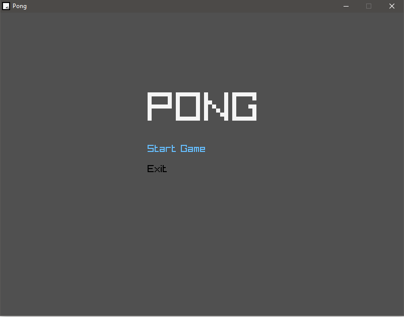

# Pong
# Clone of the Classic Game Pong (originally created by Allan Alcorn.)
# Developed with reverance and love, at 2 am, during a bout of insomnia, by a tired person, occasionally going by the name of Althea Hicks.

